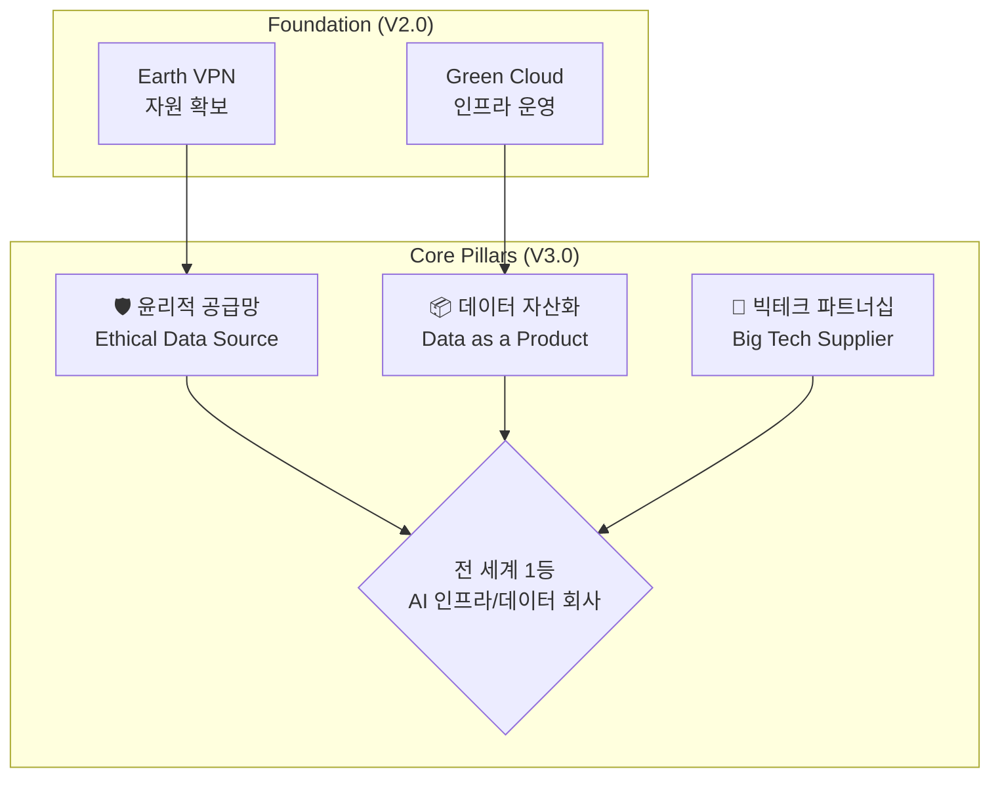

# Earth AI & Cloud 통합 전략 V3.0 (Project Green Synapse)

**문서 버전:** 3.0
**최종 업데이트:** 2025년 12월 8일
**핵심 포지셔닝:**
> **"우리는 AI 회사가 아니다. 우리는 AI를 위한 인프라와 데이터 회사다."**
> **빅테크의 경쟁자가 아닌, 필수 공급사(Supplier)가 되는 것이 목표.**

---

## 1. V3.0 삼각 전략 (The Triad Strategy)

기존 V2.0(VPN + Cloud)에서, **전 세계 1등**을 위한 3개의 핵심 전략 축을 추가합니다.

---

## 2. 전략 축 1: 윤리적 공급망 (Ethical Data Source)

> **"우리 데이터는 세계에서 가장 깨끗하다."**

*   **핵심:** 빅테크 고객의 법무팀이 안심하고 계약서에 서명할 수 있게 만든다.
*   **실행:**
    *   Earth VPN 가입 시 **GDPR/CCPA 수준의 명시적 동의** 획득.
    *   **동의 원장(Consent Ledger):** 블록체인/Immutable Log에 동의 기록 저장.
    *   **데이터 출처 인증서(Provenance Certificate):** 판매되는 모든 데이터셋에 "합법 증명서" 첨부.
*   **상세 문서:** [Compliance_and_Ethics.md](Compliance_and_Ethics.md)

---

## 3. 전략 축 2: 데이터 자산화 (Data as a Product)

> **"파이프를 파는 게 아니라, 물을 판다."**

*   **핵심:** 단순 IP/트래픽 판매(마진 낮음)를 넘어, **정제된 데이터 상품**(마진 높음)을 판다.
*   **실행:**
    *   **1차 상품 (Raw Feed):** GB당 $3~5. 원본 제공.
    *   **2차 상품 (Curated Dataset):** 주제별 정제 데이터. 건당 $500~$10,000.
    *   **3차 상품 (Labeled Data):** AI 학습용 라벨링 데이터. 라벨 1개당 $0.05~$0.50.
*   **상세 문서:** [Data_Asset_Strategy.md](Data_Asset_Strategy.md)

---

## 4. 전략 축 3: 빅테크 파트너십 (Big Tech Supplier)

> **"경쟁하지 말고, 그들의 팀이 되어라."**

*   **핵심:** Google, Microsoft, NVIDIA의 **"공급사 자격"**을 획득하여 신뢰와 채널을 확보.
*   **실행:**
    *   **NVIDIA Inception:** GPU 할인 및 "NVIDIA Partner" 배지 획득.
    *   **Microsoft for Startups:** Azure 크레딧 $150,000 확보.
    *   **Cloudflare Bandwidth Alliance:** 데이터 전송 비용 제로화.
*   **상세 문서:** [Partnership_Playbook.md](Partnership_Playbook.md)

---

## 5. 수익 모델 재정의 (Revenue Model V3.0)

| 채널 | V2.0 (기존) | V3.0 (업그레이드) | 목표 (2027) |
| :--- | :--- | :--- | :--- |
| **IP/Proxy 판매** | GB당 $5 | GB당 $5 (유지) | 10억 원 |
| **데이터셋 판매** | (없음) | 건당 $500~$10K | **+5억 원** |
| **라벨링 서비스** | (없음) | 프로젝트 협의 | **+2억 원** |
| **빅테크 공급 계약** | (없음) | 연간 계약 | **+10억 원** |
| **합계** | - | - | **27억 원+** |

---

## 6. 최종 비전 그래프 (The Endgame)

1.  **2026 (Base):** Earth VPN으로 노드 확보 + 정부 R&D로 자금 확보.
2.  **2027 (Growth):** 데이터 상품 판매 시작 + 빅테크 파트너 프로그램 합류.
3.  **2028 (Scale):** 글로벌 AI 기업들의 **"Preferred Data Supplier"**로 인정.
4.  **2030 (Exit):** 농업/환경 데이터 인프라 분야 **글로벌 1등** M&A 또는 IPO.
